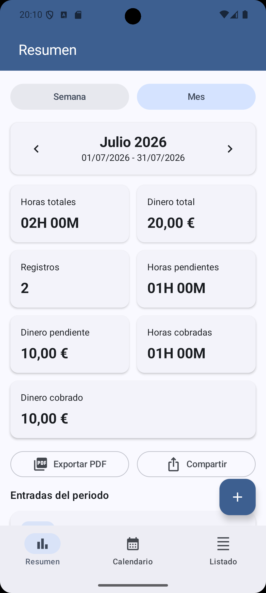
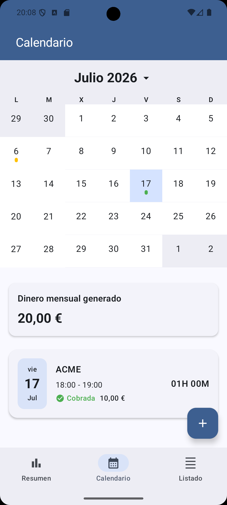
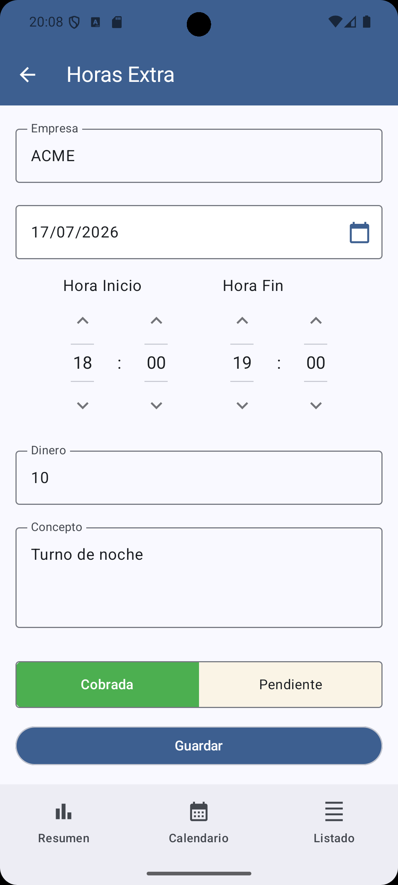
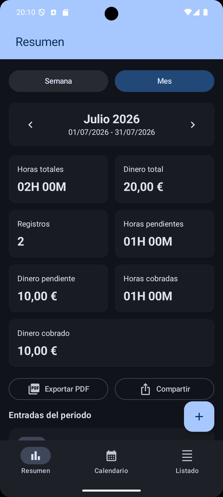
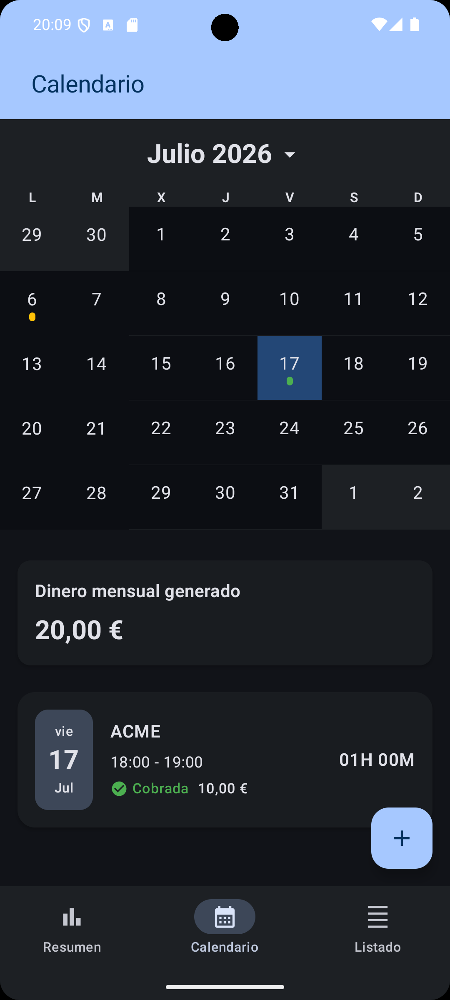
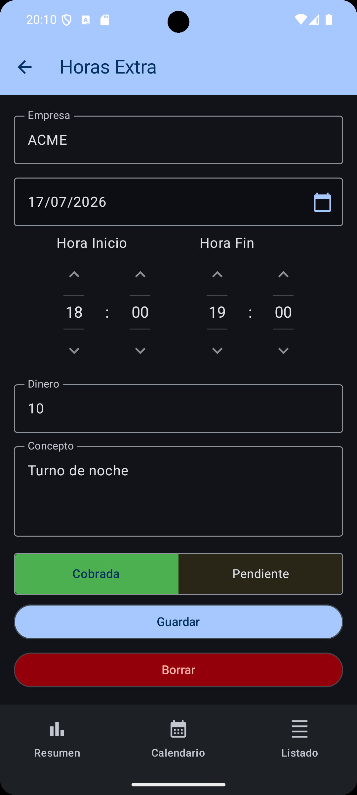

# ⏱️ OverTime Tracker

##       

## 🧩 Descripción

**OverTime Tracker** es una aplicación Android diseñada para registrar, gestionar y analizar tus horas extras de trabajo de manera sencilla y eficiente.
Su objetivo es ofrecer una experiencia moderna y minimalista para llevar un control detallado del tiempo extra dedicado, ayudándote a organizar tus compensaciones o cobros, incluyendo tambien el dinero generado por cada registro.

---

## ✨ Características principales

* ⏱️ **Registro intuitivo de horas**
Añade tus horas y minutos extra de forma rápida y sencilla.
* 💶 **Gestión del dinero generado**
Registra el importe asociado a cada hora extra y visualiza el total mensual generado directamente desde el calendario.
* 📈 **Dashboard con estadísticas**
Consulta un panel resumen semanal o mensual con horas totales, dinero generado, registros pendientes y cobrados de un solo vistazo.
* 📄 **Exportación y compartido**
Genera un PDF del resumen del periodo y compártelo directamente desde la app.
* 📊 **Historial y calendario**
Lleva un seguimiento de las jornadas anteriores y consulta tus registros en el calendario y en el listado de entradas.
* 🧠 **Arquitectura moderna (Clean Architecture + MVI en UI)**
 Basada en buenas prácticas de Android para garantizar escalabilidad y mantenibilidad.
* 💉 **Inyección de dependencias con Dagger Hilt**
* 🗄️ **Persistencia local con Room Database**
* 🎨 **Interfaz construida en Jetpack Compose (Material 3)**

---

## 🛠️ Tecnologías utilizadas

| Categoría | Tecnología |
|------------|-------------|
| **Lenguaje** | [Kotlin](https://kotlinlang.org/) |
| **UI Toolkit** | [Jetpack Compose](https://developer.android.com/jetpack/compose) |
| **Arquitectura** | Clean Architecture + MVI en UI |
| **DI Framework** | [Dagger Hilt](https://dagger.dev/hilt/) |
| **Base de datos local** | [Room](https://developer.android.com/training/data-storage/room) |
| **Navegación** | [Navigation Compose](https://developer.android.com/jetpack/compose/navigation) |
| **Asincronía** | Coroutines + Flow |
| **Estilo visual** | Material Design 3 |
| **Componente UI** | [Kizitonwose Calendar](https://github.com/kizitonwose/Calendar) (Compose) |

---

## 📱 Capturas de pantalla

| Dashboard | Calendario | Nuevo Registro|
|--------------------|-------------------|-------------------|
|  |  |  |

## 📱 Darkmode

| Dashboard | Calendario | Nuevo Registro|
|--------------------|-------------------|-------------------|
|  |  |  |

---
## 📲 Descargar la app

---

## 🧪 Estado del proyecto

🟢 **Versión actual:** `v2.0.0`

🔧 Proyecto en desarrollo activo.

Se planifican futuras actualizaciones para:
* Refinamiento visual.
* Mejoras adicionales en analítica y reporting.

---

## 👏 Créditos / Librerías de terceros

Este proyecto utiliza las siguientes librerías de código abierto:

* **[Calendar de kizitonwose](https://github.com/kizitonwose/Calendar):** Una librería altamente personalizable para vistas de calendario en Android y Jetpack Compose, utilizada para la pantalla del historial.

---

## 📝 Licencia

Este proyecto está bajo la licencia **[MIT](https://es.wikipedia.org/wiki/Licencia_MIT)**.
Puedes usar, modificar y distribuir el código libremente, siempre que se mantenga la atribución correspondiente.

---

## 🤝 Contribuciones

¡Las contribuciones son bienvenidas!
Si encuentras errores o deseas proponer mejoras, por favor abre un **issue** o envía un **pull request**.

---

## ⭐ Dale una estrella

Si te gusta este proyecto, ¡dale una estrella! ⭐
Ayuda a otros desarrolladores a encontrarlo.

---

## 👨‍💻 Autor

**Juan Gómez**
Desarrollador Android

---

> *"El tiempo es lo más valioso que una persona puede gastar." — Teofrasto*
